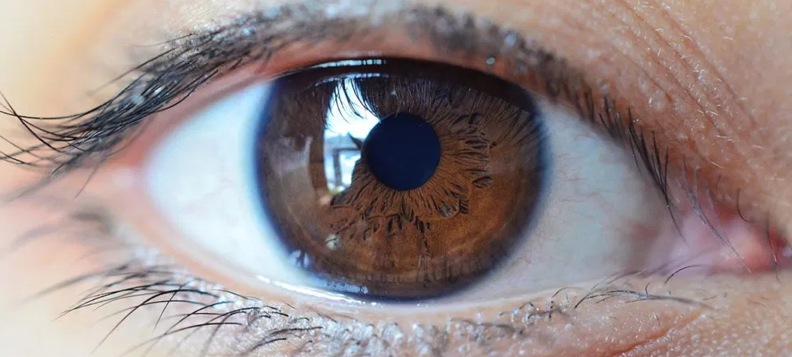
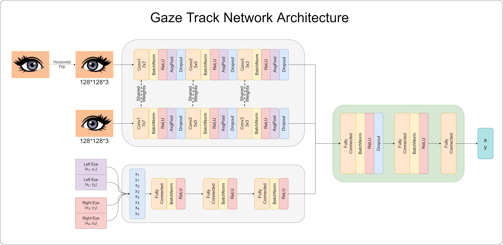
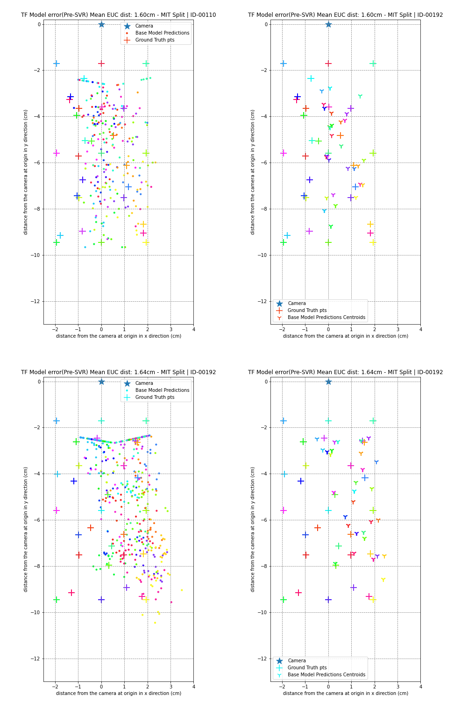
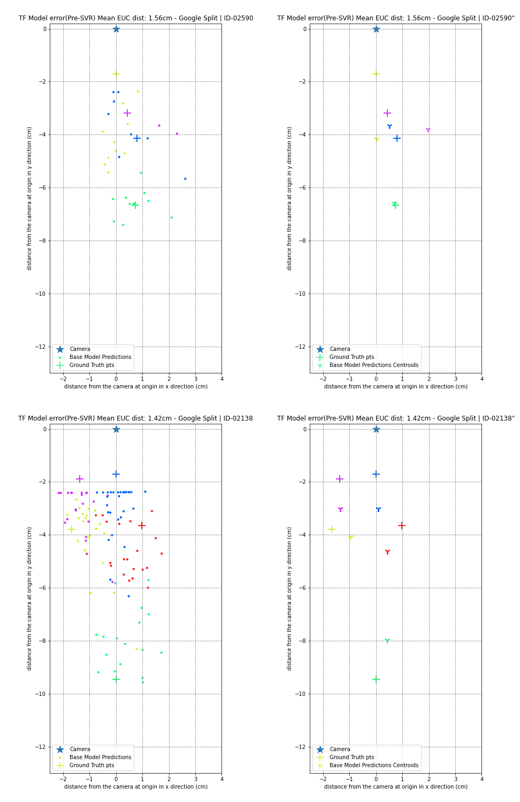

# **Gaze-Tracker**




# Introduction

This year during the GSoC’22 I worked on the Gaze Track project from last year, which is based on the implementation, fine-tuning and experimentation of Google’s paper [Accelerating eye movement research via accurate and affordable smartphone eye tracking](https://www.nature.com/articles/s41467-020-18360-5).

Eye tracking can be used for a range of purposes, from improving accessibility for people with disabilities to improving driver safety. However, modern state-of-the-art mobile eye trackers are costly, often bulky devices that require careful setup and calibration, and they tend to be expensive. The aim of this project therefore is to develop an affordable and open source alternative to these Eye Trackers.

My main task during the GSoC period was the implement the model architecture proposed by Google, in Tensorflow, run SVR experiments, and compare the results to [Abhinav’s](https://abhinavvenkatadri.github.io/Eye-tracking-GSoC/) and [Dinesh’s](https://dssr2.github.io/gaze-track/) versions. Please refer to the the posts by them on their implementation.


# Dataset

Every trained model offered in this project was developed using data from a portion of the enormous MIT GazeCapture dataset, which was made available in 2016. The dataset can be accessed by registering on the website. They include JSON files with the corresponding images that contain information such as bounding box coordinates for the eyes, faces, and other features, as well as data on the number of frames, face detections, and eye detections.

The official [GazeCapture](https://github.com/CSAILVision/GazeCapture) repository provides excellent explanations of the dataset's file structure and the information it contains.


## Splits

Only those frames with valid face and eye detections are included in the final dataset. The frame is discarded if any one of the detections is absent.

Therefore, after applying the following filters, our dataset is generated.

1. Only Phone Data
2. Only portrait orientation
3. Valid face detections
4. Valid eye detections

After the conditions listed above are satisfied, overall there are 501,735 frames from 1,241 participants.

For the base model training, there are two types of splits that are considered.

### MIT Split

Similar to how GazeCapture does it, the MIT Split keeps the train/test/validation split at the per-participant level. This means that a participant's data does not appear in more than one of the train, test, or validation set. This helps the model to train and generalize more, since the same person does not appear in all the splits.

The details regarding the split are as follows

| Train/Validation/Test | Number of Participants | Total Frames |
| --- | --- | --- |
| Train | 1,075 | 427,092 |
| Validation | 45 | 19,102 |
| Test | 121 | 55,541 |

### Google split

The unique ground truth points were used by Google to split their dataset. This means that each participant's frames are included in the train test and validation sets.

The details regarding the split are as follows

| Train/Validation/Test | Number of Participants | Total Frames |
| --- | --- | --- |
| Train | 1,241 | 366,940 |
| Validation | 1,219 | 50,946 |
| Test | 1,233 | 83,849 |

# The Network

Using Tensorflow we reproduce the neural network architecture as provided in the Google paper and the [supplementary information](https://static-content.springer.com/esm/art%3A10.1038%2Fs41467-020-18360-5/MediaObjects/41467_2020_18360_MOESM1_ESM.pdf).

The network architecture is depicted in the diagram below.



## Training

The model binary we got from google, whose pipeline we are trying to implement is in .tflite format and takes in data in form of TF Records. So we first build .tfrecs of our data to feed into the model. 

When our trained model will be converted to tflite version, there is a possibility of significant accuracy drop. This can be avoided by post-training quantization using the Tensorflow pipeline itself, implemented very similar to Google’s pipeline.

I used the Reduce LR on Plateau learning rate scheduler. Experiments were carried out with Exponential LR, Reduce LR on Plateau and no LR schedulers. Reduce LR on Plateau gave the best results. This is opposite to Abhinav's & Dinesh’s PyTorch versions.

The loss we used was Mean Squared Error (MSE) and metric Mean Euclidean Distance (MED) was defined as

```python
def mean_euc(a, b):
    euc_dist = np.sqrt(np.sum(np.square(a - b), axis=1))
    mean_euc = euc_dist.mean()
    return mean_euc
```

# Results

## Base model results -

We compare our results with that of Dinesh’s(Pytorch implementation from last year) and Abhinav’s(PyTorch Implementation, with changes in hyperparameters).

| Split | TF Implementation | Dinesh’s | Abhinav’s |
| --- | --- | --- | --- |
| MIT | 2.03cm | 2.03cm | 2.06cm |
| Google | 1.80cm | 1.86cm | 1.68cm |

Following the Tensorflow pipeline we're able to get comparable results. This would be useful later when we compare our own tflite version with the tflite binary provided by Google. 

TF model checkpoints are available on the project repository.
- [MIT Split version](https://github.com/s0mnaths/Gaze-Tracker/tree/master/checkpoints/mit_split/epoch-74-vl-2.877.ckpt)
- [Google Split version](https://github.com/s0mnaths/Gaze-Tracker/tree/master/checkpoints/google_split/epoch-99-vl-2.371.ckpt)


Here are some of the visualizations of gaze predictions from this years Tensorflow Implementation.

The **‘+’ signs** are the ground truth gaze locations, **Dots** are base model predictions and **Tri-Downs** are mean of base model predictions for that particular ground truth gaze location. Each gaze location has several frames connected to it, and as a result, has several predictions. We apply colour coding to correlate predictions to their corresponding ground truth. All dots and tri-ups of a color correspond to the ‘+’ of the same color. The __star(*)__ corresonds to the camera position, which is at the origin. 

### **MIT Split**



### Google Split



# SVR Implementation

The next task was to compare the SVR results with the current implementations. Google, in their pipeline extracts the output of shape (1,4) from the penultimate layer of the multilayer feed-forward convolutional neural network (CNN), and fits it at a per-user-level to build a high-accuracy personalized model. We follow the same.

A hook is applied to the model for obtaining the output of the penultimate layer. Once the output of the penultimate layer is obtained (1,4) a multioutput regressor SVR is applied. This was fitted on the test set of the trained model.

For sweeping the parameters of SVR, we consider:

- kernel=’rbf’
- C=20
- gamma=0.6

This is similar to what Google mentioned in their [supplementary](https://static-content.springer.com/esm/art%3A10.1038%2Fs41467-020-18360-5/MediaObjects/41467_2020_18360_MOESM1_ESM.pdf).

The Multioutput regressor’s epsilon value was sweeped between 0.01 and 1000 to find the optimum value. For fitting the SVR, the test set is split into into 70:30, and 2/3:1:3 ratio. We then consider *3 fold* and *5 fold* while doing the grid search. Using this the best parameter is obtained and this is used to fit the SVR.

## Various Splits for SVR

There are two within-individual SVR personalization versions - 

- On **Google Split** - Individuals from the base model train set  are including in the train/test set for SVR. This is not very practical since there is data leakage, and therefore will also results in minimum errors compared to other splits.
- On **MIT Split** - Individuals from the base model train set are not included in the train/test set for SVR. This is more practical.

Within both these versions, there are two sub-versions

- On **Unique Ground Truth values** - We split the whole set into train and test, based on unique ground truth values. This results in both the sets having different ground truth values. More specifically, we randomly pick out one frame corresponding to each ground truth value, and hence there are 30 frames in the set as there are 30 unique Ground truth values.
- On **Random Data points/samples** - We split the whole set into train and test, randomly, which results in data points coming from all screen positions in both both the sets.

The Unique Ground Truth values version corresponds more to the real life scenario since the random Data Points version may have very similar samples in both the train and test sets, which would result in poor generalization.

Another split we tried is the **No Shuffle** split, where we use, say first 70% of the test set points for fitting the SVR, and the latter 30% for testing the SVR. This also corresponds to the actual use-case, where we first calibrate the SVR, and then the subject uses the model.

We select 10 users based on the highest number of frames from each of the above mentioned splits. This is the data that the base model has not seen, and so SVR is fitted on them. 


## MIT Split

### 1. Mean Results Comparison

### Base-model Results:

| Implementation | MED |
| --- | --- |
| Abhinav’s | 1.82cm |
| New(TF) | 1.76cm |

**Post-SVR Results:**

1. *Random Data points/samples (All Frames)*

<table><thead><tr>
<th>Implementation</th><th colspan=2>70 &amp; 30 split</th><th colspan=2>2/3 &amp; 1/3 split</th></tr>
</thead><tbody><tr><td></td><td>Shuffle = True</td><td>Shuffle = False</td><td>Shuffle = True</td>
<td>Shuffle = False</td></tr><tr><td>Abhinav’s</td><td>1.46cm</td><td>-</td><td>-</td><td>-</td></tr>
<tr><td>New(TF)</td><td>1.48cm</td><td>1.69cm</td><td>1.49cm</td><td>1.64cm</td></tr></tbody></table>


2. *Unique Ground Truth values (30 points)*

<table><thead><tr><th>Implementation</th><th colspan=2>70 &amp; 30 split</th>
<th colspan=2>2/3 &amp; 1/3 split</th></tr></thead><tbody><tr><td></td>
<td>Shuffle = True</td><td>Shuffle = False</td><td>Shuffle = True</td><td>Shuffle = False</td>
</tr><tr><td>Abhinav’s</td><td>1.76cm</td><td>-</td><td>-</td><td>-</td></tr><tr>
<td>New(TF)</td><td>1.73cm</td><td>1.75cm</td><td>1.84cm</td><td>1.72cm</td></tr>
</tbody></table>


### 2. Per-Individual Comparison:

1. *Random Data points/samples (All Frames)*

<table><thead><tr>
<th>User ID</th><th>No. of frames</th><th>MED(Base model)</th><th colspan=2>SVR-3CV (70&amp;30)</th><th colspan=2>SVR-3CV (2/3&amp;1/3)</th>
</tr></thead><tbody><tr><td></td><td></td><td></td><td>Shuffle = True</td><td>Shuffle = False</td><td>Shuffle = True</td>
<td>Shuffle = False</td></tr><tr><td>3183</td><td>874</td><td>1.51cm</td><td>1.34cm</td><td>1.42cm</td><td>1.35cm</td>
<td>1.32cm</td></tr><tr><td>1877</td><td>860</td><td>2.37cm</td><td>1.28cm</td><td>1.13cm</td><td>1.32cm</td><td>1.09cm</td>
</tr><tr><td>1326</td><td>784</td><td>1.66cm</td><td>1.31cm</td><td>1.47cm</td><td>1.29cm</td><td>1.44cm</td>
</tr><tr><td>3140</td><td>783</td><td>1.68cm</td><td>1.54cm</td><td>1.44cm</td><td>1.56cm</td><td>1.45cm</td>
</tr><tr><td>2091</td><td>788</td><td>1.84cm</td><td>1.80cm</td><td>1.98cm</td><td>1.81cm</td>
<td>1.92cm</td></tr><tr><td>2301</td><td>864</td><td>1.95cm</td><td>1.36cm</td><td>1.75cm</td>
<td>1.34cm</td><td>1.69cm</td></tr><tr><td>2240</td><td>801</td><td>1.43cm</td><td>1.24cm</td>
<td>1.52cm</td><td>1.23cm</td><td>1.46cm</td></tr><tr><td>382</td><td>851</td><td>2.54cm</td>
<td>2.44cm</td><td>2.89cm</td><td>2.44cm</td><td>2.75cm</td></tr><tr><td>2833</td><td>796</td>
<td>1.73cm</td><td>1.68cm</td><td>1.86cm</td><td>1.67cm</td><td>1.87cm</td></tr><tr><td>2078</td>
<td>786</td><td>1.22cm</td><td>0.82cm</td><td>1.42cm</td><td>0.83cm</td><td>1.37cm</td></tr></tbody></table>


2. *Unique Ground Truth values (30 points)*

<table><thead><tr><th>User ID</th><th colspan=2>SVR-3CV (70&amp;30)</th><th colspan=2>SVR-3CV (2/3&amp;1/3)</th>
</tr></thead><tbody><tr><td></td><td>Shuffle = True</td><td>Shuffle = False</td><td>Shuffle = True</td><td>Shuffle = False</td>
</tr><tr><td>3183</td><td>1.83cm</td><td>0.85cm</td><td>1.88cm</td><td>1.58cm</td></tr><tr>
<td>1877</td><td>1.82cm</td><td>1.46cm</td><td>1.64cm</td><td>1.47cm</td></tr><tr><td>1326</td>
<td>2.39cm</td><td>2.10cm</td><td>2.12cm</td><td>2.09cm</td></tr><tr><td>3140</td><td>1.20cm</td>
<td>1.30cm</td><td>1.73cm</td><td>1.58cm</td></tr><tr><td>2091</td><td>1.81cm</td><td>1.99cm</td><td>1.94cm</td><td>1.73cm</td>
</tr><tr><td>2301</td><td>1.43cm</td><td>1.50</td><td>1.77cm</td><td>1.61cm</td></tr><tr><td>2240</td><td>1.26cm</td><td>1.62cm</td>
<td>1.16cm</td><td>1.73cm</td></tr><tr><td>382</td><td>2.43cm</td><td>2.52cm</td><td>2.69cm</td><td>2.39cm</td></tr>
<tr><td>2833</td><td>1.82cm</td><td>1.82cm</td><td>1.89cm</td><td>1.79cm</td></tr>
<tr><td>2078</td><td>1.27cm</td><td>1.28cm</td><td>1.09cm</td><td>1.20cm</td></tr></tbody></table>


### **Analysis**

We can see that the mean losses when considering all the frames are lower, compared to the unique ground truth values version. This is due to data leakage as discussed previously. We also notice that the overall mean errors post SVR is significantly lower than that of base model errors. When we don’t shuffle the set during split, the loss increases, since it mimics the real life scenario when the user might look at new ground truth points. When we consider frames with unique ground truth values, the errors per individual are varying a lot, which results in almost similar mean errors. Since this was only trained on 30 frames, the SVR has not generalized well, and possibly learned some unwanted features. This will be cleaned out in the future work.

## Google Split

### 1. Mean Results Comparison

### Base-model Results:

| Implementation | MED |
| --- | --- |
| Abhinav’s | 1.15cm |
| New(TF) | 1.32cm |

**Post-SVR Results:**

1. *Random Data points/samples (All Frames)*

<table><thead><tr><th>Implementation</th><th colspan=2>70 &amp; 30 split</th><th colspan=2>2/3 &amp; 1/3 split</th></tr>
</thead><tbody><tr><td></td><td>Shuffle = True</td><td>Shuffle = False</td><td>Shuffle = True</td><td>Shuffle = False</td>
</tr><tr><td>New(TF)</td><td>1.04cm</td><td>1.14cm</td><td>1.12</td><td>1.04</td></tr></tbody></table>

### 2. Per-Individual Comparison:

<table><thead><tr><th>User ID</th><th>No. of frames</th><th>MED(Base model)</th><th colspan=2>SVR-3CV (70&amp;30)</th><th colspan=2>SVR-3CV (2/3&amp;1/3)</th>
</tr></thead><tbody><tr><td></td><td></td><td></td><td>Shuffle = True</td><td>Shuffle = False</td><td>Shuffle = True</td>
<td>Shuffle = False</td></tr><tr><td>503</td><td>965</td><td>1.51cm</td><td>1.37cm</td><td>1.35cm</td><td>1.32cm</td>
<td>1.41cm</td></tr><tr><td>1866</td><td>1018</td><td>1.23cm</td><td>0.86cm</td><td>1.24cm</td><td>1.18cm</td><td>0.88cm</td>
</tr><tr><td>2459</td><td>1006</td><td>1.34cm</td><td>0.69cm</td><td>0.81cm</td><td>0.81cm</td><td>0.68cm</td></tr><tr>
<td>1816</td><td>989</td><td>1.09cm</td><td>0.92cm</td><td>0.93cm</td><td>0.92cm</td><td>0.94cm</td></tr><tr><td>3004</td>
<td>983</td><td>1.41cm</td><td>1.18cm</td><td>1.07cm</td><td>1.05cm</td><td>1.16cm</td></tr><tr><td>3253</td><td>978</td><td>1.24cm</td>
<td>0.84cm</td><td>1.07cm</td><td>0.98cm</td><td>0.84cm</td></tr><tr><td>1231</td><td>968</td><td>1.38cm</td><td>1.09cm</td><td>1.33cm</td>
<td>1.36cm</td><td>1.06cm</td></tr><tr><td>2152</td><td>957</td><td>1.53cm</td><td>1.36cm</td><td>1.28cm</td><td>1.27cm</td><td>1.38cm</td>
</tr><tr><td>2015</td><td>947</td><td>1.27cm</td><td>1.12cm</td><td>1.23cm</td><td>1.2cm</td><td>1.11cm</td></tr><tr><td>1046</td>
<td>946</td><td>1.24cm</td><td>0.97cm</td><td>1.07cm</td><td>1.07cm</td><td>0.97cm</td></tr></tbody></table>


### Analysis

Since the Google split has frames of each individual in both the sets, it results in very low errors on the 10 individual dataset, as compared to the MIT split. Google uses this version, and quite possibly this is the reason that their mean errors are very low (0.46±0.03cm)

## **App**

Data was collected using an Android App. The users' photo was clicked at random times while the circle/dots are appearing on the screen. The centre of the circle is noted as the X,y coordinate and frames were assigned to particular coordinate depending on the time stamp.

## Challenges and Learning

- Learning and implementing the network in Tensorflow
- Getting accustomed to training a network on HPC clusters
- Hyperparameter tuning and using model tracking apps like CometML
- Visualizing the outputs and interpreting them.
- Training on large datasets

## Future Scope and Improvements

- Understanding if we are querying the Google model binary correctly
- Understanding the SVR patterns in different model versions and find out how well our model is generalizing.
- Training the model with normalization function used by Google.
- Test the model on the phone data collected by our own app, and compare with Google's binary.
- Comparing with different implementations such as iTracker to see whether the model can be further improved by extending the network.
- Testing on only frames whose tilt / pan / roll is within ±10 degrees
- While testing the google split some of those points are leaked, but so it is also common to the Google’s method. This has to be cleaned up in future work.

## References

```
1. Eye Tracking for Everyone
K.Krafka*, A. Khosla*, P. Kellnhofer, H. Kannan, S. Bhandarkar, W. Matusik and A. Torralba
IEEE Conference on Computer Vision and Pattern Recognition (CVPR), 2016

2. Accelerating eye movement research via accurate and affordable smartphone eye tracking
Valliappan, N., Dai, N., Steinberg, E., He, J., Rogers, K., Ramachandran, V., Xu, P., Shojaeizadeh, M., Guo, L., Kohlhoff, K. and Navalpakkam, V.
Nature communications, 2020
```


## Acknowledgements

I would like to thank my mentors [Dr. Suresh Krishna](https://www.mcgill.ca/physiology/directory/core-faculty/suresh-krishna) and [Mr.Dinesh Sathia Raj](https://www.linkedin.com/in/dssr/) for their guidance in every aspect of this project. This work would not have been possible without their support.
